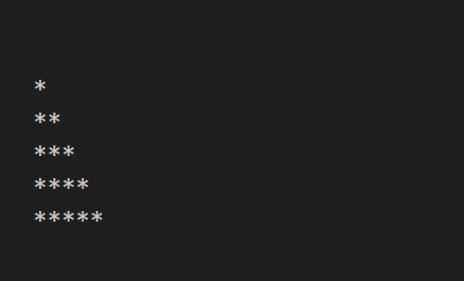

#### 1.How To find duplicate elements in array in javascript
```javascript
// 1.How To find duplicate elements in array in javascript
const numbers = [2, 5, 9, 6, 2, 7, 8, 9];
const duplicate = numbers.filter((element, index, array) => array.indexOf(element) != index);
console.log('duplicate numbers are: ',duplicate);
```


#### 1a.How To remove duplicate elements/ make unique in array in javascript
```javascript
// 1a.How To remove duplicate elements/ make unique in array in javascript
const numbers = [2, 5, 9, 6, 2, 7, 8, 9];
const removeDuplicate = numbers.filter((element, index, array) => array.indexOf(element) == index);
console.log('unique arrays: ',removeDuplicate); 
// output: 
// unique arrays:  [ 2, 5, 9, 6, 7, 8 ]
```


#### 2. How To find max/min in a given array in javascript
```javascript
// first way of getting max 
var myArray = [1, 5, 6, 2, 3];
var maxNumber = Math.max(...myArray);
console.log('Max number from an array: ',maxNumber)
```


```javascript
// first way of getting min 
var minNumber = Math.min(...myArray);
console.log('Min number from an array: ',minNumber);
```


```javascript
// second way of getting max
const arrNumber = [11, 22, 88, 22, 99, 88];
const maxFunction = (array) => {
    return array.reduce((previousValue, currentValue) => {
        return previousValue > currentValue ? previousValue : currentValue;
    })
}
console.log('Using reduce method Max number from an array: ', maxFunction(arrNumber));

```


```javascript
// second way of getting min
const arrNumber2 = [11, 22, 88, 22, 99, 88];
const minFunction = (array) => {
    return array.reduce((previousValue, currentValue) => {
        return previousValue < currentValue ? previousValue : currentValue;
    })
}
console.log('Using reduce method Min number from an array: ', minFunction(arrNumber2));
```


```javascript
// third way of getting max
const arrNumber3 = [11, 22, 88, 22, 99, 88];
const maxOutput = arrNumber3.reduce((pre,cur)=> {
    return pre > cur ? pre : cur;
})
console.log("Using reduce method making simple, Max number from an array: ",maxOutput);

```


```javascript
// third way of getting min
const arrNumber4 = [11, 22, 88, 22, 99, 88];
const minOutput = arrNumber4.reduce((pre,cur)=> {
    return pre < cur ? pre : cur;
})
console.log("Using reduce method making simple, Min number from an array: ",minOutput);


```


#### 4. How To find second largest value and remove first largest value in a given array in javascript
```javascript

```


#### 7. How To find even or odd numbers in a given array in javascript
```javascript
// 7. How To find even or odd numbers in a given array in javascript 
const numbers = [1, 2, 3, 8, 9, 12, 16];
const even = numbers.filter((item) => {
    return item % 2 == 0;
})
const odd = numbers.filter((item) => {
    return item % 2 ==! 0;
})
console.log("Even numbers: ",even);
console.log("Odd numbers: ",odd);
```


#### 8. How To find the sum of all elements in a given array in javascript
```javascript
// 8. How To find the sum of all elements in a given array in javascript 
const numbers = [1,2,3,4];
const sum = numbers.reduce((pre,cur)=>{
    return pre+cur;
})
console.log("The sum of all elements in a given array is: ",sum);
```


#### 9. How To find the factorial of a  given number in javascript
```javascript
// 9. How To find the factorial of a  given number in javascript
const input = 5;
var fact = 1;
if (input < 0) {
    console.log(`Factorial of ${input} is not possible.`);
}
else {
    for (let i = 1; i <= input; i++) {
        fact = fact * i;
    }
    console.log(`Factorial of ${input} is ${fact}`);
}
```


#### 10. How To find prime number in javascript 
```javascript
// 10. How To find prime number in javascript 
let number = 7;
if (number == 1) {
    console.log(`${number} is not prime number.`);
}
else if (number < 1) {
    console.log(`${number} is not prime number.`);
}
else {
    for (let i = 2; i < number; i++) {
        if (number % 2 == 0) {
            var result = (`${number} is not prime number.`);
            break;
        }
        else {
            var result = (`${number} is prime number.`);
            
        }
    }
    console.log(result);
}
```


#### 11. How To find numbers of vowel string in javascript
```javascript
// 11. How To find numbers of vowel from string in javascript 
let string = 'Arafat';
const vowels = ['a','e','i','o','u'];
var count = 0;
const countVowel = string => {
    for( let letter of string.toLowerCase()){
        if(vowels.includes(letter)){
            count++;
        }
    }  
    return count;  
}
console.log('Number of vowel is '+countVowel(string)+ ' in '+string);

```


#### 12. How To reverse a string in javascript
```javascript
// 12. How To reverse a string in javascript 
// array k reverse :
var myString = ['A','h','m','e','d'];
console.log("Array k reverse: " + myString.reverse());


// string k reverse korar kono build in method nai. kintu array k reverse korar build in method ase.
// 3 steps:  
// firstly, string k array te convert kore,
// then, array k reverse korbo,
// then, array k join kore dibo.
var string = "Faisal";
const reverseString = (str) => {
    var splitStringIntoArray = str.split('');
    splitStringIntoArray.reverse();
    var arrayJoinAsString = splitStringIntoArray.join(''); 
    return arrayJoinAsString; 
}

console.log('Main string is : ' + string + ' and Reverse string is : ' +reverseString(string));
```


#### 13. How To find palindrome in javascript
```javascript
// 13. How To find palindrome in javascript 
var string = "aba";
string = string.toLocaleLowerCase();
const findPalindrome = (str) => {
    var reverseString = str.split('').reverse().join('');
    if(str == reverseString){
        return `${str} is palindrome`;
    }
    else {
        return `${str} is not palindrome`;
    }
}
console.log(findPalindrome(string));
```


#### 14. How To swap two variable without using the third variable in javascript
```javascript
// 14. How To swap two variable without using the third variable in javascript 
var a = 30;
var b = 15;
console.log("Main array : A is " + a + " and B is " + b);
[a, b] = [b, a];
console.log(`Swap array : A is ${a} and B is ${b}`);

```


#### 15. How To marged two arrays in javascript
```javascript
// 15. How To marged two arrays in javascript 
const arr1 = ['1', '5', '2', '34'];
const arr2 = ['12', '35', '12', '134'];
// concat 
const margedArray = arr1.concat(arr2);
console.log("First array : ", arr1);
console.log("Second array : ", arr2);
console.log("Marged array : ", margedArray);

// sort 
// ascending order, small to large
const sortedArray = margedArray.sort(function (a, b) {
    return a - b;
})
console.log('Sorted Array, Ascending order : ', sortedArray);

// marged array using spread operator 
const margedUsingSpread = [...arr1, ...arr2];
console.log("marged Using Spread Operator : ", margedUsingSpread);

// ascending order, large to small
const sortedArray2 = margedArray.sort(function (a, b) {
    return b - a;
})
console.log('Sorted Array2, Descending order : ', sortedArray2);

```


#### 16. How To find factor of a integer in javascript
```javascript
// 16. How To find factor of a integer in javascript 
const num = 27;
console.log("Factor of " + num + ' is : ');
for (let i = 0; i <= num; i++) {
    if (num % i == 0) {
        console.log(i);
    }
}
```


#### 17. How To make a simple calculator in javascript
##### 17.html file
```javascript
<script>
const num1 = parseFloat(prompt("Enter num 1"));
const operator = (prompt("Select Operator either + - * /"));
const num2 = parseFloat(prompt("Enter num 2"));
let result;
if(operator == '+'){
       result = num1 + num2;
}
else if(operator == '-'){
       result = num1 - num2;
}
else if(operator == '*'){
       result = num1 * num2;
}
else {
       result = (num1 / num2).toFixed(2);
}

console.log(`${num1} ${operator} ${num2} = ${result}`);

</script>
```


#### 18. How To compare two arrays are equal or not in javascript
```javascript
// 18. How To compare two arrays are equal or not in javascript 
const arr1 = [1, 2, 3, 4, 5, 6, 2];
const arr2 = [5, 2, 3, 4, 1, 1, 6];
arr1.sort();
arr2.sort();
console.log(arr1);
console.log(arr2);
const isArrayLengthSame = arr1.length == arr2.length && arr1.every((element) => {
    if (arr2.indexOf(element) > -1) {
        return (element);
    }
})

// output 
if (isArrayLengthSame) {
    console.log("Two Arrays are equal");
}
else {
    console.log("Warning! Two Arrays are NOT equal");
}
```


#### 19. How To find intersection of two arrays in javascript
```javascript
// 19. How To find intersection of two arrays in javascript
const arr1 = [2, 9, 6, 8, 4, 4, 4];
const arr2 = [4, 8, 6, 9, 12];

const intersection = arr1.filter((element)=> {
    return arr2.includes(element);
})
// all value that are belongs to this two array 
console.log(intersection);

// now same value remove
// set return like object 
// set { } diye output dey. array te dey na.
// tai set ta k array er vitor neya hoyese. 
const set = [...new Set(intersection)]

// getting unique values 
console.log(set);

```


#### 20. How To find union of two arrays in javascript
```javascript
// 20. How To find union of two arrays in javascript 
const arr1 = [1, 2, 6, 8, 17];
const arr2 = [4, 8, 6, 19, 12, 17];

const totalArray = [...arr1, ...arr2];
const setUnion = [...new Set(totalArray)];
console.log(setUnion);
```


#### 23. How to convert first letter of string in uppercase in javascript
```javascript
// 23. How to convert first letter of string in uppercase in javascript 
const string = 'i love you';
const firstLetterUpper = (string) => {
    var newString = string.split(' ');
    var firstLetter = newString.map((value)=>{
        return value.charAt(0).toUpperCase() + value.slice(1);
    })
     
    return firstLetter;
}
console.log(firstLetterUpper(string));
```


#### 24. How to find fibonacci sequence in javascript
```javascript
// 24. How to find fibonacci sequence in javascript 
let a = 0;
let b = 1;
for (let index = 0; index < 10; index++) {
    let temp = a + b;
    a = b;
    b = temp;
    console.log(temp);
}
```


#### 25. How to print LEFT TRIANGLE pattern, RIGHT TRIANGLE pattern, PYRAMID pattern and DIAMOND SHAPE pattern in javascript
`LEFT TRIANGLE pattern`
<p align='center'>
  
</p>

```javascript
// 25. How to print LEFT TRIANGLE pattern, RIGHT TRIANGLE pattern, PYRAMID pattern and DIAMOND SHAPE pattern in javascript 

// LEFT TRIANGLE pattern
let string = '';
for (let i = 1; i < 6; i++) {
    for (let j = 1; j <= i; j++) {
        string += "*";
    }
    string += '\n';
}
console.log(string);
```

`RIGHT TRIANGLE pattern`
```javascript

```

`PYRAMID pattern`
```javascript

```

`DIAMOND SHAPE pattern`
```javascript

```

#### 26. How to Check the No of Occurrence of Character in String in javascript/ count specific input letter in string.
```javascript
// 26. How to Check the No of Occurrence of Character in String in javascript/ count specific input letter in string. 
const string = "faisala";
const letter = 'a';
let count = 0;
for (let index = 0; index < string.length; index++) {
    if(string[index] == letter){
        count++;
    }
}
console.log(`In ${string} occurence of ${letter} is ${count}`);
```


